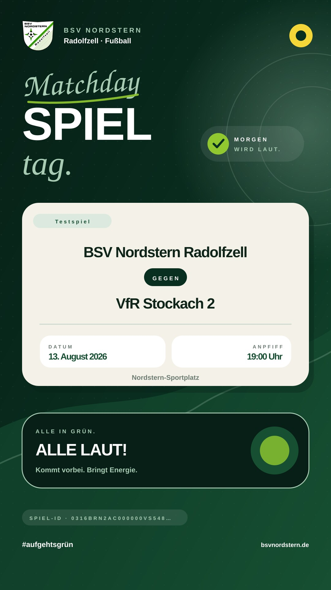
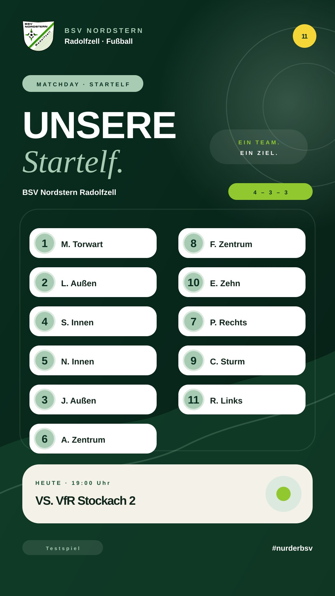
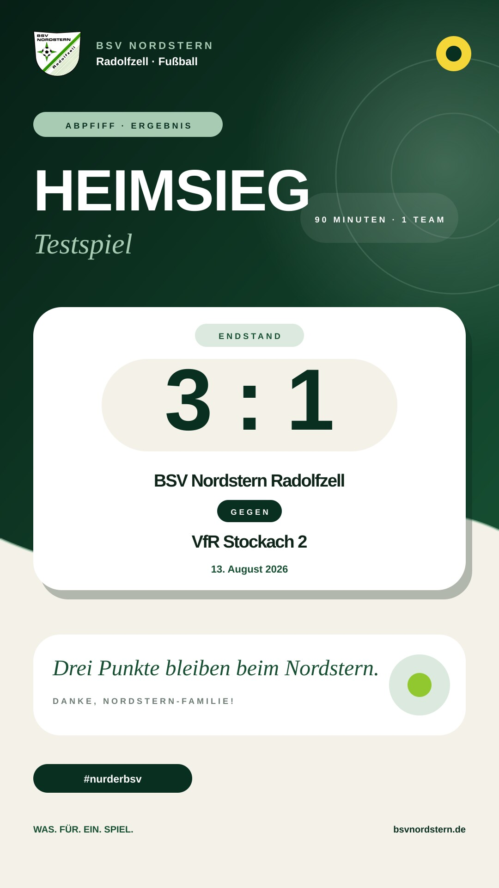
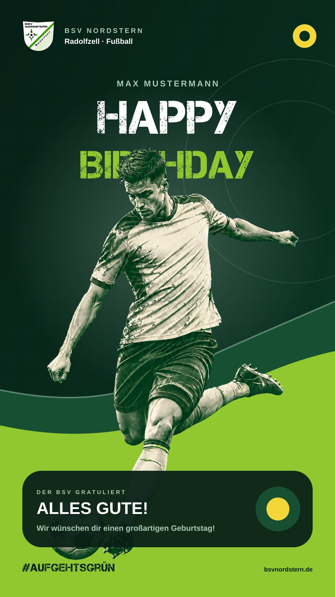

# BSV Social Media

Eigenständiges Projekt für die Gestaltung und Automatisierung von Instagram-Stories des BSV Nordstern Radolfzell.

Der aktuelle Stand liefert:

- ein aus der Website abgeleitetes Corporate Design,
- editierbare Story-Vorlagen in 1080 × 1920 Pixel, einschließlich eines Geburtstagsmotivs,
- einen lokalen und einen online betriebenen Renderer für Spielankündigung, Aufstellung, Ergebnis und Geburtstag,
- Beispieldaten für die fussball.de-Spiel-ID `0316BRN2AC000000VS5489BTVU7GTVLE`,
- eine aktive Supabase-Struktur mit Datenbank, privatem Storage, Edge Functions und Fünf-Minuten-Cron,
- eine [private Admin-Oberfläche](https://bsv-story-automatik.jerome-ernsberger.chatgpt.site) für Spiele, Aufstellungen, Ergebnisse und Geburtstage,
- einen zentralen, standardmäßig aktiven Testmodus.

## Vorschau

| Spielankündigung | Aufstellung | Ergebnis |
| --- | --- | --- |
|  |  |  |

| Geburtstag |
| --- |
|  |

Das vollständige Gestaltungssystem ist als [Corporate-Design-Dokument](docs/corporate-design.md) und als [visuelle HTML-Fassung](docs/corporate-design.html) enthalten.

## Schnellstart

Voraussetzung sind Node.js 22 oder neuer und ImageMagick (`magick`).

```bash
npm run check
npm run render:all
```

Die erzeugten Dateien landen in `output/`. Bereits freigegebene Beispiele liegen unter `previews/`.

Ein einzelnes Motiv lässt sich so erzeugen:

```bash
npm run render -- --type announcement --input examples/match.json
npm run render -- --type lineup --input examples/match.json --lineup examples/lineup.json
npm run render -- --type result --input examples/match.json
npm run render -- --type birthday --input examples/birthday.json --photo bilder/spieler.png
```

Für das Geburtstagsmotiv eignet sich ein freigestelltes PNG. Ohne `--photo` wird automatisch der freigestellte Action-Fußballer des Gestaltungssystems verwendet.

## Online-Automatik

Die private Admin-Oberfläche läuft unter:

<https://bsv-story-automatik.jerome-ernsberger.chatgpt.site>

Sie ist auf den Site-Eigentümer beschränkt. Supabase Cron gleicht die kommenden Spiele der vier aktiven BSV-Mannschaften stündlich mit den auf der BSV-Webseite eingebetteten FUSSBALL.DE-Widgets ab und startet den Vorschau-Worker alle fünf Minuten. Neue Spiele erzeugen automatisch Jobs für Ankündigung, Aufstellung und Ergebnis; Geburtstage erzeugen jährlich einen eigenen Job. Fällige Jobs werden aktuell als PNG gerendert und in einem privaten Storage-Bucket abgelegt. Über zeitlich begrenzte Links können die Vorschauen in der Admin-Oberfläche kontrolliert werden.

Vor dem ersten Login muss die URL einmal in Supabase unter **Authentication → URL Configuration** als Site URL und Redirect URL eingetragen werden. Nach dem ersten Login wird die konkrete Supabase-Benutzer-ID einmalig in `social_admins` freigeschaltet.

## Benutzerverwaltung für das Social-Media-Team

- Jeder Teamzugang bekommt in Supabase Auth einen eigenen Benutzer mit E-Mail und Passwort.
- Eine öffentliche Selbstregistrierung bleibt deaktiviert; neue Konten werden ausschließlich durch den Administrator angelegt.
- In der Tabelle `public.social_admins` wird der Benutzer anschließend mit `role` (`admin` oder `sm-team`) und `is_active = true` freigeschaltet.
- Der Administrator ist der Nutzer mit `role = 'admin'`; aktuell ist das Jérôme.
- Nach erfolgreichem Login wird der Benutzer direkt in den bestehenden Social Media Builder weitergeleitet.
- Ein Logout erfolgt über die bereits vorhandene Abmeldefunktion in der Admin-Oberfläche.

## Sicherheitsstandard

`INSTAGRAM_TEST_MODE` ist zentral definiert und standardmäßig aktiv. Nur der exakte Wert `false` erlaubt später einem Publisher den echten Versand. Der aktuelle Code enthält absichtlich noch keinen aktiven Meta-Publisher. Er kann also keine Story versehentlich veröffentlichen.

Secrets gehören ausschließlich in GitHub Actions Secrets oder Supabase Project Secrets und niemals in dieses Repository.

## Projektstruktur

```text
brand/                 Farben, Typografie und Vereinswappen
config/                überwachte Spiele und Zeitregeln
docs/                  Corporate Design und technische Architektur
examples/              Testdaten
previews/              freigegebene Beispiel-Renderings
scripts/               lokale Render- und Prüfskripte
src/                   gemeinsame Renderlogik
supabase/               Datenmodell und vorbereiteter Worker
templates/              editierbare SVG-Storyvorlagen
tests/                  automatisierte Tests
```

## Nächste Betriebs-Schritte

1. Admin-URL in Supabase Auth erlauben, einmal anmelden und den Benutzer freischalten.
2. Automatisch importierte Spiele sowie Aufstellungen, Ergebnisse und Geburtstage im Testbetrieb prüfen.
3. Änderungen an den FUSSBALL.DE-Widgets und fehlgeschlagene Team-Abgleiche regelmäßig kontrollieren.
4. Instagram Professional Account mit der Meta Graph API verbinden und den PNG/JPEG-Publishingpfad testen.
5. Erst nach erfolgreichen Freigabetests `INSTAGRAM_TEST_MODE=false` setzen.

Die Details stehen in [docs/automation-architecture.md](docs/automation-architecture.md). Der kontrollierte Wechsel vom Test- in den Produktivbetrieb ist in [docs/howto-go-productive.md](docs/howto-go-productive.md) beschrieben.
